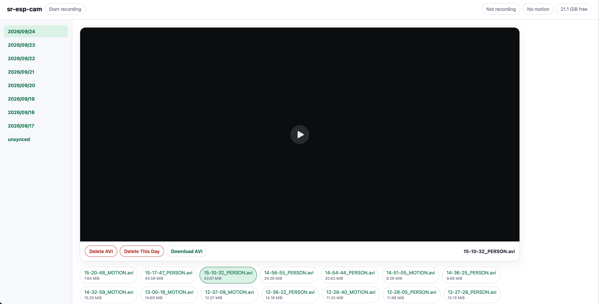

# ESPHome Camera Recorder

An ESPHome component for recording clips from an ESPHome ESP32-S3 camera to a microSD card. It can detect motion, save AVI clips to an SD card, and is configurable via YAML + Home Assistant, as well as using native ESPHome actions for customizable automations and plugins.

## Requirements
- ESP32-S3 with **at least 4MB PSRAM and 8MB flash**. *You can get by on 4MB flash if you disable ESPHome OTA and possibly set a custom partition table.*
- [Supported camera](https://esphome.io/components/esp32_camera/)
- microSD card formatted in FAT32 *(MBR)*

## Features

- Native ESPHome component for easy updates, management, and automation
- Recordings are saved as MJPEG AVI files under `recordings/YYYY/MM/DD/` on the SD card
- Full Web UI at `http://<device-address>/recordings` to browse, play, download, or delete clips. The page and downloads use the configured Basic HTTP username and password
- Adjustable motion detection built in, as well as optional on-device person detection and classification
- `start` action to start recording immediately
- `stop_and_classify` action finalizes the AVI, checks up to four frames for people, and labels it `_PERSON`, `_MOTION`, or `_UNCLASSIFIED`
- Plain `stop` action saves the AVI without classification
- Controls and tuning options exposed directly to Home Assistant
- Two **Record** switches decide whether successfully classified person and other-motion clips are kept
- Sensors showing recording, classification, SD card, and model status



## Installation and Configuration
The easiest way to get started is to either create a [new reusable package containing the below YAML](https://esphome.io/components/packages/), or just paste it into an existing ESP32-S3 configuration. I set the camera pins to what mine uses; other examples can be found [on ESPHome's website.](https://esphome.io/components/esp32_camera/#configuration-examples)

```yaml
external_components:
  - source: github://inventor7777/ESPHome-Camera-Recorder
    components: [camera_recorder]

i2c:
  - id: camera_i2c
    sda: GPIO4
    scl: GPIO5

time:
  - platform: homeassistant
    id: homeassistant_time

esp32_camera:
  id: main_camera
  resolution: 640x480
  jpeg_quality: 15
  max_framerate: 10 fps
  idle_framerate: 0.1 fps
  external_clock:
    pin: GPIO15
    frequency: 8MHz # 8MHz works great with the OV2640 and OV3660, but this should be raised to 20MHz for the OV56xx series.
  i2c_id: camera_i2c
  data_pins: [GPIO11, GPIO9, GPIO8, GPIO10, GPIO12, GPIO18, GPIO17, GPIO16]
  vsync_pin: GPIO6
  href_pin: GPIO7
  pixel_clock_pin: GPIO13

camera_recorder:
  id: recorder
  camera_id: main_camera
  time_id: homeassistant_time
  clk_pin: GPIO39
  cmd_pin: GPIO38
  data0_pin: GPIO40
  web_username: !secret camera_recorder_web_username
  web_password: !secret camera_recorder_web_password

  directory: /recordings
  format_if_mount_failed: false
  light_accent: "#0878ff"
  dark_accent: "#65a8ff"
  light_active: "#dcecff"
  dark_active: "#1b385c"

  mounted:
    name: SD Card Mounted
  recording:
    name: Recording
  classifying:
    name: Classifying
  models_ready:
    name: Person Model Ready
  person_detected:
    name: Person Detected
  motion:
    name: Motion
    on_press:
      - camera_recorder.start: recorder
    on_release:
      - camera_recorder.stop_and_classify: recorder
  motion_score:
    name: Motion Score
  sd_free:
    name: SD Card Free
  motion_threshold:
    name: Motion Threshold
  motion_hold_time:
    name: Motion Hold Time
  motion_detection_fps:
    name: Motion Detection FPS
  min_person_detections:
    name: Minimum Person Detections
  record_people:
    name: Record People
  record_other_motion:
    name: Record Other Motion
  auto_deletion:
    name: Auto Deletion
  motion_detection:
    name: Motion Detection

button:
  - platform: template
    name: Start Recording
    on_press:
      - camera_recorder.start: recorder
  - platform: template
    name: Stop Recording
    on_press:
      - camera_recorder.stop: recorder
  - platform: template
    name: Stop and Classify Recording
    on_press:
      - camera_recorder.stop_and_classify: recorder
  - platform: template
    name: Delete Oldest Day
    on_press:
      - camera_recorder.delete_oldest_days:
          id: recorder
          days: 1
```

Make sure to add `camera_recorder_web_username`, and `camera_recorder_web_password` to `secrets.yaml`. You can also specify them directly in YAML if you wish.

## Defaults and Descriptions

| Setting | Default | Meaning |
| --- | --- | --- |
| `directory` | `/recordings` | Directory on the SD card; the card itself mounts at `/sdcard`. |
| `format_if_mount_failed` | `false` | If enabled, a failed mount may format the card and erase its contents. |
| `light_accent`, `dark_accent` | `#0878ff`, `#65a8ff` | Browser page accent colors. |
| `light_active`, `dark_active` | `#dcecff`, `#1b385c` | Browser page active-state colors. |
| Motion Threshold | `18%` | Minimum Motion Score to trigger Motion; adjustable from 0.1% to 100%. |
| Motion Hold Time | `10 s` | Time before Motion clears; adjustable from 1 to 300 seconds. |
| Motion Detection FPS | `0.8` | Motion samples per second; adjustable from 0.1 to 2.0. |
| Minimum Person Detections | `2` | Positive samples required among up to four AVI frames; adjustable from 1 to 4. |
| Record People / Record Other Motion | On / On | Keep clips after successful classification. |
| Auto Deletion | On | After a recording, delete the oldest complete recording days when card free space is below 10%; today's clips are always retained. |
| Motion Detection | On | When off, stops motion frame processing, clears Motion, and sets Motion Score to 0%. |

Number and switch values are restored after reboot. `mounted` and `recording` sensors are optional; the other listed controls and status entities are created by default. Without valid time, recordings go into `recordings/unsynced/`.

### Espressif Person Detection

Before the first boot, mount the microSD card on your computer and run:

```sh
./download_models.sh /path/to/sd-card-root
```

Pass the **card root**, not its `models` directory. The script downloads and verifies `models/s3/pedestrian_detect_pico_s8_v1.espdl`. **Person Model Ready** indicates whether it loaded. Motion detection and recording can still run without the model, but person classification cannot.

### Notes and Limitations
- The ESP32-S3 is very capable, but this pushes it pretty far, especially with ESPHome overhead. Don't expect more than 5-10 Mbps download speeds, more than 15 FPS from the camera, or insanely accurate classifications. You can save significant idle resources by disabling the native motion detection and using an mmWave or PIR motion sensor in ESPHome or through Home Assistant.
- Component code was written by GPT-6 Sol, but I stayed fully in the loop and I tested this *exhaustively* on real hardware before releasing.
